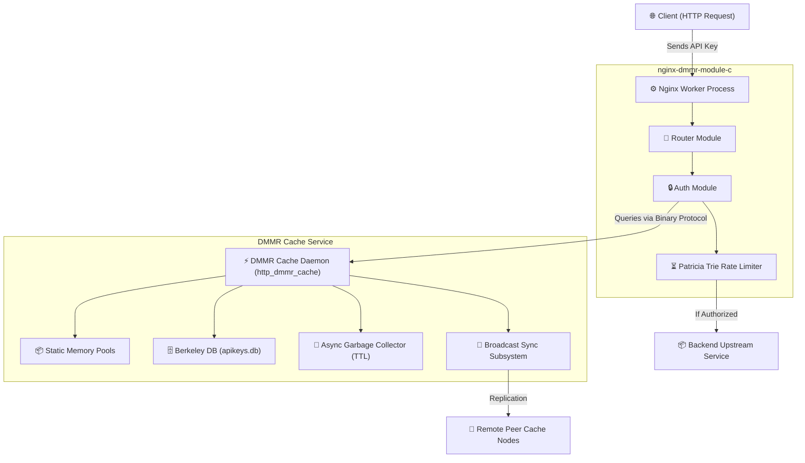

# Nginx DMMR API Gateway (Kong Alternative)

[]()
[](LICENSE)

A native C, high-performance API gateway module for Nginx, coupled with a distributed persistence cache layer powered by Berkeley DB. The system operates on a zero-malloc request path philosophy to guarantee low-latency, event-driven API gateway routing, authentication, and rate limiting directly within Nginx worker processes.

---

## 🗺️ System Architecture

The DMMR Gateway utilizes a decentralized architectural model where Nginx workers validate credentials against a local cache microservice (`http_dmmr_cache`) via persistent Unix Domain Sockets or TCP loopback.



---

## ⚡ Key Architectural Principles

- **Zero-Allocation Hot Path**: Memory allocations during normal request processing are done using pre-allocated static pools (e.g., job queues, payload buffers, commands) to avoid memory fragmentation and heap lock contention.
- **Patricia Trie Rate Limiter**: Implemented in-memory locally within the Nginx worker processes, eliminating external dependencies like Redis.
- **Eventual Consistency**: Peer-to-peer sync via background replication commands (`OP_SYNC`).
- **Deterministic Routing**: Priority-based path, method, and host matching.

---

## 📁 Repository Structure

- `nginx-dmmr-module-c/` - Core Nginx HTTP Gateway module source files.
- `http_dmmr_cache/` - High-performance cache microservice with Berkeley DB persistence.
- `python/` - Test scripts and client tools.

---

## 🛠️ Cache Service (`http_dmmr_cache`)

### Dependencies

#### Debian/Ubuntu
```bash
sudo apt-get update
sudo apt-get install libmicrohttpd-dev libdb-dev
```

#### RHEL/Fedora
```bash
sudo dnf install libmicrohttpd-devel libdb-devel
```

### Build Targets

```bash
cd http_dmmr_cache

# Build release target (optimized with -O2, asserts disabled)
make release

# Build debug target (adds logging, compiles with -O0 -g3 -DDEBUG)
make debug
```

### Run Options

Start the daemon binding to UNIX sockets, TCP, or both:
```bash
# Run binding to unix domain socket only (/tmp/dmmr_cache.sock)
./http_dmmr_cache --unix

# Run binding to TCP port only (127.0.0.1:9080)
./http_dmmr_cache --tcp

# Run binding to both TCP and Unix domain socket
./http_dmmr_cache --both
```

---

## 📡 DMMR Binary Protocol Specification

All communication between Nginx (or test clients) and the cache service uses a custom binary protocol.

### 1. Modern Frame Format (`struct dmmr_frame`)

Every modern request/response frame header is exactly **24 bytes** long. Fields must be sent in **network byte order (big-endian)**:

| Offset (Bytes) | Field Name | Data Type | Description |
| :--- | :--- | :--- | :--- |
| `0 - 1` | `magic` | `uint16_t` | Protocol magic indicator (`0xD4D4`) |
| `2 - 3` | `version` | `uint16_t` | Protocol version (`1`) |
| `4 - 5` | `opcode` | `uint16_t` | Operation code: `1=GET`, `2=SET`, `3=DEL`, `4=SYNC` |
| `6 - 7` | `flags` | `uint16_t` | Flags: `1` if request originates from a cluster peer |
| `8 - 11` | `key_len` | `uint32_t` | Length of the key in bytes |
| `12 - 15` | `value_len` | `uint32_t` | Length of the value in bytes (0 for `GET`/`DEL`) |
| `16 - 23` | `timestamp` | `uint64_t` | Epoch timestamp in microseconds |

*Following the header, the payload is transmitted sequentially: `Key Data` (size: `key_len`) + `Value Data` (size: `value_len`).*

### 2. Legacy Request Format

If the packet prefix does not match the DMMR magic signature (`0xD4D4`), it is parsed as a legacy request:

- Header: `uint16_t opcode` + `uint16_t key_len` (Total: **4 bytes**).
- Payload: `key` data.
- *Note: Only `OP_GET` (opcode `1`) is supported under legacy mode.*

---

## 🔎 Debug Logging Subsystem

When the Cache Service is built in debug mode (`make debug`), detailed trace messages are printed to `stderr`.

### Macro Definition (`dmmr_config.h`)

```c
#ifdef DEBUG
#define DMMR_LOG_DEBUG(fmt, ...) fprintf(stderr, "[DEBUG] " fmt "\n", ##__VA_ARGS__)
#else
#define DMMR_LOG_DEBUG(fmt, ...) do {} while(0)
#endif
```

### Trace Events Recorded
- **OP_GET / Legacy OP_GET**: Key requested, status of db lookup, value length returned.
- **OP_SET / OP_SYNC**: Key set, timestamps, source node IDs, and value sizes.
- **OP_DEL**: Key deletion requests and status updates.

---

## ⚙️ Nginx Module Compilation & Configuration

### Build Nginx with DMMR Module

```bash
wget http://nginx.org/download/nginx-1.24.0.tar.gz
tar -xzf nginx-1.24.0.tar.gz
cd nginx-1.24.0

./configure --add-module=/path/to/nginx-dmmr-module-c
make
sudo make install
```

### Configuration Example (`nginx.conf`)

Add the following configuration blocks to manage routing, backends, and cache communication:

```nginx
http {
    dmmr_enable on;

    # Backend Services
    dmmr_service api_service_1 localhost:8001;
    dmmr_service api_service_2 localhost:8002;

    # Routes mapping to services
    dmmr_route /api/v1 api_service_1;
    dmmr_route /api/v2 api_service_2;

    server {
        listen 80;
        server_name _;

        location / {
            dmmr_enable on;
            
            # Path to cache daemon
            dmmr_cache_addr unix:/tmp/dmmr_cache.sock; # or tcp:127.0.0.1:9080
            
            # Local Rate Limiting Configuration
            dmmr_rate_limit 120;
            dmmr_rate_window 60000; # 1 minute in ms

            # Proxy forward using module dynamic upstream selection
            proxy_pass http://$dmmr_upstream;

            proxy_set_header Host $host;
            proxy_set_header X-Real-IP $remote_addr;
            proxy_set_header X-Forwarded-For $proxy_add_x_forwarded_for;
        }
    }
}
```

---

## 🧪 Testing Suite

A suite of verification scripts is stored under `python/`.

### Automated Integration Tests

To run automated checks that validate both modern and legacy protocol interactions:
```bash
python3 python/test_cache_suite.py
```

Expected output:
```
Executando Teste SET & GET (Protocolo Moderno)... [OK]
Executando Teste DEL & GET (Protocolo Moderno)... [OK]
Executando Teste GET (Protocolo Legado)... [OK]

Todos os testes passaram com sucesso!
```

---

## 🛡️ Robustness and Security Audits

The codebase has undergone refactoring to resolve common execution failures under production workloads:

1. **TCP Streaming Header Fix**: Resolved a logic flaw in `ngx_http_dmmr_auth.c` where the socket header loop broke out early at 4 bytes even when receiving a modern 8-byte response header. This ensures compatibility with TCP streaming segment boundaries.
2. **Buffer Overflow Guards**: Replaced weak key length checks in `ngx_http_dmmr_auth.c` to prevent heap/stack overflow. API keys larger than the static request buffer boundary (`sizeof(req_buf) - sizeof(frame)`) are now rejected immediately at gateway level.
3. **Byte Order De-duplication**: Fixed a bug in `dmmr_server.c` where host byte-order conversions (`ntohl` / `ntohs`) were applied twice, causing key lengths to scale into invalid values and drop connections.
4. **Compile-time Rate Limit fix**: Fixed scoping issue in `ngx_http_dmmr_rate_limit.c` by passing the `rate_window` context to the node pruning routines, eliminating compile errors.