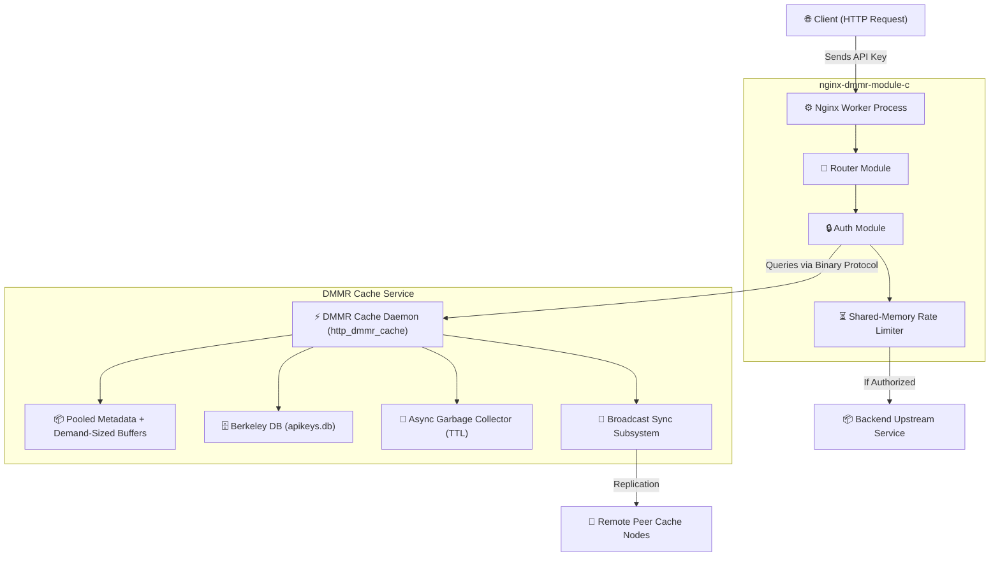

# Nginx DMMR API Gateway (Kong Alternative)

[]()
[](LICENSE)

A native C, high-performance API gateway module for Nginx, coupled with a distributed persistence cache layer powered by Berkeley DB. The gateway performs routing, authentication, and rate limiting directly in Nginx worker processes; the cache uses stable pool metadata and demand-sized buffers to keep memory use bounded under normal traffic.

> **0.2.0-beta:** the integration suite contains 16 test groups covering the
> cache, gateway and recovery paths. Run it on the current build before a
> release, because it starts and stops real local processes.
> Cache authentication currently uses synchronous socket I/O with one-second
> timeouts and one retry. Non-blocking, event-driven cache I/O is the highest
> priority for the next release; it is not part of this beta.

---

## 🗺️ System Architecture

The DMMR Gateway utilizes a decentralized architectural model where Nginx workers validate credentials against a local cache microservice (`http_dmmr_cache`) via persistent Unix Domain Sockets or TCP loopback.


```mermaid
graph TD
    Client["🌐 Client (HTTP Request)"] -->|Sends API Key| Nginx["⚙️ Nginx Worker Process"]
    
    subgraph nginx_module ["nginx-dmmr-module-c"]
        Nginx --> Router["🧭 Router Module"]
        Router --> Auth["🔒 Auth Module"]
        Auth --> RateLimit["⏳ Shared-Memory Rate Limiter"]
    end
    
    Auth -->|Queries via Binary Protocol| CacheDaemon["⚡ DMMR Cache Daemon (http_dmmr_cache)"]
    
    subgraph cache_service ["DMMR Cache Service"]
        CacheDaemon --> MemoryPools["📦 Pooled Metadata + Demand-Sized Buffers"]
        CacheDaemon --> BDB["🗄️ Berkeley DB (apikeys.db)"]
        CacheDaemon --> GC["🧹 Async Garbage Collector (TTL)"]
        CacheDaemon --> Broadcast["📢 Broadcast Sync Subsystem"]
    end
    
    Broadcast -->|Replication| PeerNode["🔗 Remote Peer Cache Nodes"]
    RateLimit -->|If Authorized| Upstream["📦 Backend Upstream Service"]
```

---

## ⚡ Key Architectural Principles

- **Bounded Pool Metadata, Demand-Sized Buffers**: queue metadata is pooled in stable chunks. Payload and replication-value buffers are allocated only for the received value; buffers larger than 64 KiB are released when returned to the payload pool.
- **Shared-Memory Rate Limiter**: A slab-backed rbtree and LRU/expiry queue are shared by all Nginx workers, so a client IP has one counter per zone without requiring Redis.
- **Eventual Consistency**: Peer-to-peer sync via background replication commands (`OP_SYNC`).
- **Deterministic Routing**: Priority-based path, method, and host matching.

---

## 📁 Repository Structure

- `nginx-dmmr-module-c/` - Core Nginx HTTP Gateway module source files.
- `http_dmmr_cache/` - High-performance cache microservice with Berkeley DB persistence.
- `tests/` - Integration test suite and test client helpers.

---

## 🛠️ Cache Service (`http_dmmr_cache`)

### Dependencies

#### Debian/Ubuntu
```bash
sudo apt-get update
sudo apt-get install libmicrohttpd-dev libdb-dev
```

#### RHEL/Fedora
```bash
sudo dnf install libmicrohttpd-devel libdb-devel
```

### Build Targets

```bash
cd http_dmmr_cache

# Build release target (optimized with -O2, asserts disabled)
make release

# Build debug target (adds logging, compiles with -O0 -g3 -DDEBUG)
make debug
```

### Recent Implementation Highlights

The cache daemon now covers a broader set of correctness and operational concerns:

- DELETE operations are persisted as tombstones in Berkeley DB and propagated through the cluster.
- GET requests map Berkeley DB not-found results to the protocol not-found status instead of falling back to a generic error.
- Cluster peers are reaped when they become stale or unreachable, preventing leaked connections and stale state.
- Cluster frames are validated with cluster identity checks, and discovery can recover from known peers as well as seed nodes.
- Graceful shutdown stops discovery and closes the cluster listener before
  joining its thread, so a listener blocked in `accept()` is released without
  requiring `SIGKILL`.

### Run Options

Start the daemon binding to UNIX sockets, TCP, or both:
```bash
# Run binding to Unix socket only
./dmmr_cache --unix

# Run binding to TCP port only (127.0.0.1:9080)
./dmmr_cache --tcp

# Run binding to both TCP and Unix domain socket
./dmmr_cache --both
```

### Unix socket with systemd Nginx (WSL/Linux)

When Nginx runs as a systemd service with `PrivateTmp=true`, it cannot access
sockets created under the shell's `/tmp`. Use `/run/dmmr` instead. The cache,
the test suite and the Nginx directive must use the same path.

```bash
sudo install -d -o "$USER" -g "$(id -gn)" -m 0777 /run/dmmr

export DMMR_SOCKET_PATH=/run/dmmr/dmmr_cache.sock
export DMMR_SOCKET_MODE=0666
# 9081 is used by the second Nginx test server; avoid its cluster-port conflict.
export DMMR_CLUSTER_PORT=9091

cd tests
python3 suite_tests.py
```

For the Nginx server that uses Unix sockets:

```nginx
dmmr_cache_addr unix:/run/dmmr/dmmr_cache.sock;
```

For production, use a shared group and permissions `2770` on `/run/dmmr` and
`0660` for `DMMR_SOCKET_MODE`, rather than the permissive development settings
above.

### systemd service

The repository includes a service unit that starts the cache automatically,
restarts it after a failure, and creates the runtime and state directories. It
runs as the `nginx` user so Nginx can access the Unix socket without a separate
group configuration.

After building `dmmr_cache`, install and enable it with:

```bash
sudo install -m 0755 http_dmmr_cache/dmmr_cache /usr/local/bin/dmmr_cache
sudo install -D -m 0644 http_dmmr_cache/deploy/systemd/dmmr-cache.service \
  /etc/systemd/system/dmmr-cache.service
sudo install -D -m 0644 http_dmmr_cache/deploy/systemd/dmmr-cache.env.example \
  /etc/dmmr/dmmr-cache.env
sudo install -D -m 0644 http_dmmr_cache/deploy/systemd/nginx-dmmr-cache.conf \
  /etc/systemd/system/nginx.service.d/dmmr-cache.conf
sudo systemctl daemon-reload
sudo systemctl enable --now dmmr-cache.service
sudo systemctl restart nginx.service
```

Use this cache address in Nginx:

```nginx
dmmr_cache_addr unix:/run/dmmr/dmmr_cache.sock;
```

The `nginx-dmmr-cache.conf` drop-in makes systemd start the cache before Nginx.
Adjust `/etc/dmmr/dmmr-cache.env` for ports, workers and database path, then
restart the service with `sudo systemctl restart dmmr-cache`.

### Container

The cache can run as a standalone container. Its default container command is
TCP-only, which avoids sharing a Unix socket between containers.

```bash
cd http_dmmr_cache
docker compose up --build
```

It persists Berkeley DB data in the `dmmr-cache-data` volume and listens on
`0.0.0.0:9080`. When Nginx runs in another container on the same Compose
network, configure it with `dmmr_cache_addr tcp:dmmr-cache:9080;` rather than
`unix:/tmp/dmmr_cache.sock`.

The runtime settings may be overridden without rebuilding:

```bash
DMMR_BIND_ADDRESS=0.0.0.0 DMMR_CACHE_PORT=9080 \
DMMR_CLUSTER_NAME=prod DMMR_CLUSTER_SEEDS=10.0.0.1:9081 \
DMMR_DB_PATH=/data/apikeys.db DMMR_WORKERS=4 ./dmmr_cache --tcp
```

Supported variables are `DMMR_BIND_ADDRESS`, `DMMR_CACHE_PORT`,
`DMMR_CLUSTER_PORT`, `DMMR_CLUSTER_SEEDS`, `DMMR_ADVERTISE_ADDRESS`, `DMMR_CLUSTER_NAME`,
`DMMR_DB_PATH`, `DMMR_WORKERS`, `DMMR_SOCKET_PATH`, and
`DMMR_SOCKET_MODE` (octal, for example `0660`). Command-line options override
the worker count, cluster options, and port settings.

### Cluster Broadcast & Auto-Discovery

Nodes in a cluster automatically discover peers via seed nodes and replicate updates (`OP_SET`, `OP_DEL`, `OP_SYNC`).
Cluster isolation is guaranteed by `DMMR_CLUSTER_NAME` (or `--cluster-name`): nodes with mismatching cluster names reject synchronization during the `OP_CLUSTER_HELLO` handshake.

```bash
# Node 1 (Seed)
./dmmr_cache --tcp --cluster-name=production --advertise=10.0.0.1 --cluster-port=9091

# Node 2 (Connects to Seed)
./dmmr_cache --tcp --cluster-name=production --advertise=10.0.0.2 --cluster-port=9091 --seeds=10.0.0.1:9091
```

---

## 📡 DMMR Binary Protocol Specification

All communication between Nginx (or test clients) and the cache service uses a custom binary protocol.

### 1. Modern Frame Format (`struct dmmr_frame`)

Every modern request/response frame header is exactly **24 bytes** long. Fields must be sent in **network byte order (big-endian)**:

| Offset (Bytes) | Field Name | Data Type | Description |
| :--- | :--- | :--- | :--- |
| `0 - 1` | `magic` | `uint16_t` | Protocol magic indicator (`0xD4D4`) |
| `2 - 3` | `version` | `uint16_t` | Protocol version (`1`) |
| `4 - 5` | `opcode` | `uint16_t` | `1=GET`, `2=SET`, `3=DEL`; `4=SYNC` is used by replication; `10=PING`, `11=STATUS`, `12=STATS` are diagnostic operations |
| `6 - 7` | `flags` | `uint16_t` | Flags: `1` if request originates from a cluster peer |
| `8 - 11` | `key_len` | `uint32_t` | Length of the key in bytes |
| `12 - 15` | `value_len` | `uint32_t` | Length of the value in bytes (0 for `GET`/`DEL`) |
| `16 - 23` | `timestamp` | `uint64_t` | Epoch timestamp in microseconds |

*Following the header, the payload is transmitted sequentially: `Key Data` (size: `key_len`) + `Value Data` (size: `value_len`).*

Cluster traffic uses a separate version-3 frame that includes `node_id`,
`expire_at`, and a cluster-name-derived identity. This preserves the public
version-1 cache protocol while allowing peers to replicate LWW metadata,
TTL, and tombstones.

### 2. Legacy Request Format

If the packet prefix does not match the DMMR magic signature (`0xD4D4`), it is parsed as a legacy request:

- Header: `uint16_t opcode` + `uint16_t key_len` (Total: **4 bytes**).
- Payload: `key` data.
- *Note: Only `OP_GET` (opcode `1`) is supported under legacy mode.*

---

## 🔎 Debug Logging Subsystem

When the Cache Service is built in debug mode (`make debug`), detailed trace messages are printed to `stderr`.

### Macro Definition (`dmmr_config.h`)

```c
#ifdef DEBUG
#define DMMR_LOG_DEBUG(fmt, ...) fprintf(stderr, "[DEBUG] " fmt "\n", ##__VA_ARGS__)
#else
#define DMMR_LOG_DEBUG(fmt, ...) do {} while(0)
#endif
```

### Trace Events Recorded
- **OP_GET / Legacy OP_GET**: Key requested, status of db lookup, value length returned.
- **OP_SET / OP_SYNC**: Key set, timestamps, source node IDs, and value sizes.
- **OP_DEL**: Key deletion requests and status updates.

---

## ⚙️ Nginx Module Compilation & Configuration

### Build Nginx with DMMR Module

```bash
wget http://nginx.org/download/nginx-1.24.0.tar.gz
tar -xzf nginx-1.24.0.tar.gz
cd nginx-1.24.0

./configure --add-module=/path/to/nginx-dmmr-module-c
make
sudo make install
```

### Configuration Example (`nginx.conf`)

Add the following configuration blocks to manage routing, backends, and cache communication:

```nginx
http {
    # One shared counter store for every Nginx worker. Optional: if omitted,
    # the module creates dmmr_rate_limit with 10 MiB by default.
    dmmr_rate_zone dmmr_limit:10m;

    dmmr_enable on;

    # Backend Services
    dmmr_service api_service_1 localhost:8001;
    dmmr_service api_service_2 localhost:8002;

    # Routes mapping to services
    dmmr_route /api/v1 api_service_1;
    dmmr_route /api/v2 api_service_2;

    server {
        listen 80;
        server_name _;

        location / {
            dmmr_enable on;
            
            # Path to cache daemon. /run is suitable for a systemd-managed Nginx.
            dmmr_cache_addr unix:/run/dmmr/dmmr_cache.sock;
            # Or use TCP: dmmr_cache_addr tcp:127.0.0.1:9080;
            
            # Global-per-IP Rate Limiting Configuration
            dmmr_rate_limit 120;
            dmmr_rate_window 60000; # 1 minute in ms

            # Proxy forward using module dynamic upstream selection
            proxy_pass http://$dmmr_upstream;

            proxy_set_header Host $host;
            proxy_set_header X-Real-IP $remote_addr;
            proxy_set_header X-Forwarded-For $proxy_add_x_forwarded_for;
        }
    }
}
```

---

## 🧪 Testing Suite

The integration suite is stored under `tests/`. It starts its own cache and
two local backends; Nginx must already be running with the DMMR module loaded.

### Automated Integration Tests

To run automated checks that validate both modern and legacy protocol interactions:
```bash
cd tests
python3 suite_tests.py
```

The fixture restores its test credentials after every normal cache restart.
The rate-limit check accepts only `200` or `429` and requires the limit to be
reached, so an authentication failure cannot be counted as a successful request.

The suite covers listener modes, modern and legacy protocols, malformed input,
authentication, routing, upstream/cache failures, recovery, 60-second RSS
stability, rate limiting, and a 20×50-request load simulation.

### Graceful shutdown

On `SIGTERM` or `SIGINT`, the daemon stops discovery, closes its cluster
listener and then joins the listener thread. This ordering releases a blocking
`accept()` call and allows normal process termination. Validate this path in
the deployment environment with a real `SIGTERM` before relying on automated
restarts.

---

## 🛡️ Robustness and Security Audits

The codebase has undergone refactoring to resolve common execution failures under production workloads:

1. **TCP Streaming Header Fix**: Resolved a logic flaw in `ngx_http_dmmr_auth.c` where the socket header loop broke out early at 4 bytes even when receiving a modern 8-byte response header. This ensures compatibility with TCP streaming segment boundaries.
2. **Buffer Overflow Guards**: Replaced weak key length checks in `ngx_http_dmmr_auth.c` to prevent heap/stack overflow. API keys larger than the static request buffer boundary (`sizeof(req_buf) - sizeof(frame)`) are now rejected immediately at gateway level.
3. **Byte Order De-duplication**: Fixed a bug in `dmmr_server.c` where host byte-order conversions (`ntohl` / `ntohs`) were applied twice, causing key lengths to scale into invalid values and drop connections.
4. **Shared rate limiting**: rate counters now live in an Nginx shared-memory zone, making the configured limit apply across worker processes.
